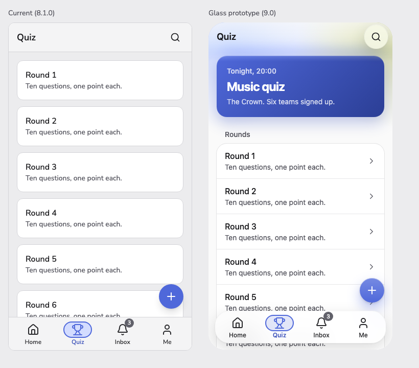
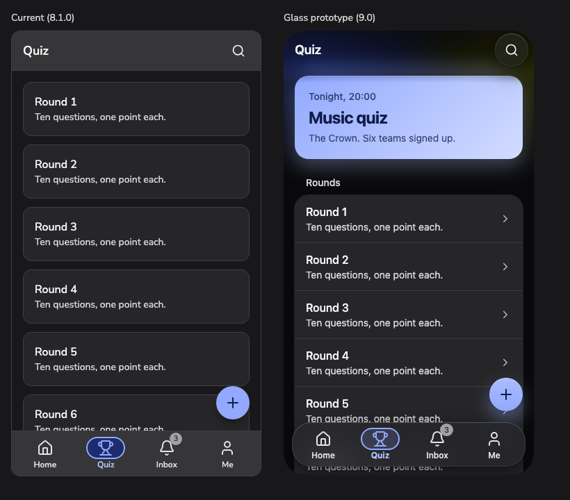

# Zabi Components — why the components feel outdated

**Date:** 6 October 2026. **Reviewed at:** `792b901` (8.1.0-beta.5) on `release/8.1.0`.

This is a visual review, not an accessibility or API review. It follows the September review in `DESIGN_REVIEW.md`, whose fixes (shared lightness curve, one control-height scale, role-based radii) are in place. The question here is different: the library is now coherent, so why does it still look dated?

**Verdict.** The system is sound, but its visual language is a 2019–2021 dashboard: grey page, white shadowed cards, heavy pastel status fills, flat controls that only change colour. The app shell and navigation chrome are the most dated part. Almost all of the first half sits in tokens in `src/app.css`; the shell half is partly styling and partly a structural gap in AppShell.

## Method and limits

- **Part 1** is based on the live docs site at desktop width: 22 component pages captured, about ten read closely in light and two in dark.
- **Part 2** is based on the Storybook stories (build of 5 October) at 390px with touch emulation and at 1200px, in light and dark.
- **Not reviewed:** open overlays (Modal, Dropdown), Drawer, SidebarPanel, the collapsed sidebar, live scroll behaviour, real devices.
- Colours, sizes and class names are read from the source or from computed styles. Whether something looks dated is a judgement.

---

## Part 1 — The library as a whole

Biggest cause first.

### 1. Grey canvas with white shadowed cards

The page is `base-150` (`#ececee`) and the default Card is white with `shadow-sm` (`src/components/atoms/Card.svelte:45`). Current products use a near-white canvas, hairline borders, and keep shadows for overlays.

### 2. Status colours are heavy and dusty

Every `-subtle` fill is ramp step 200 (`src/app.css:499`), so Alerts are saturated pastel blocks with a border and coloured text on top (`src/components/molecules/Alert.svelte:78`). The shared lightness curve fixed contrast but left every hue equally muted: mustard warning (`#9e6000`), olive accent (`#707400`). The solid Accent button reads muddy next to Primary.

### 3. Boxes inside boxes

List rows each have a border and sit inside a bordered, padded shell (`src/app.css:1922`, `src/components/atoms/ListItem.svelte:55`), giving a double outline. Calendar event rows and Badges (fill plus same-hue border) do the same. Current lists use dividers or spacing.

### 4. Controls are flat

Buttons have a flat fill with no shadow, edge or highlight. The off Toggle is a mid-grey track (`base-400`, `src/app.css:348`) that reads as disabled. Tabs are a static 2px underline (`src/components/molecules/Tabs.svelte:224`).

### 5. Motion is only colour fades

48 of about 75 transitions in `src/components` are `transition-colors`, mostly 150ms on Tailwind's default easing. The theme has no duration or easing tokens. Nothing slides, such as a tab indicator or a segmented-control thumb.

### 6. Shadows are Tailwind's stock recipes

They run at a flat 14% (`src/app.css:648-653`), and `shadow-lg` is used more than `shadow-sm` (14 vs 8). Current elevation is layered, softer, and paired with a 1px edge.

### 7. Typeface

Nunito Sans is a rounded face strongly tied to 2017–2020 product UI, and at 14px/500 in controls it looks soft. The mono stack is Monaco/Menlo/Ubuntu Mono (`src/app.css:71`). The sharper Familjen Grotesk headings are set by the docs site only; the library's default heading face is Nunito too.

### 8. Dark mode reads as inverted light mode

Pastel fills sit on near-black: periwinkle Primary, salmon Delete, olive Accent.

### What is not the cause

Radii (8/12/16), control heights (32/40/48), focus rings, state coverage and the token architecture are current. Leave them.

Items 2 and 4 are partly side effects of the September fixes (shared lightness curve, step-200 subtle fills, neutral disabled). Those fixed contrast and coherence, but the result was not art-directed afterwards.

---

## Part 2 — AppShell and the navigation chrome

### Structural causes

**AppShell is a phone column only.** Its API is `header`, `children`, `footer` in an `h-dvh` flex column (`src/components/organisms/AppShell.svelte`). There is no rail or sidebar slot and no breakpoint behaviour, so on a tablet the tab bar just stretches. Current shells adapt: bottom tabs, then a rail, then a sidebar. Here SidebarShell and TopNavbar are separate components that share nothing with AppShell.

**Mobile and desktop chrome use different surfaces.** AppBar, BottomTabBar and StickyActionBar are `bg-surface-elevated` (`#f4f4f5`). TopNavbar and the sidebar are `bg-background` (`#ececee`) (`organisms/TopNavbar.svelte:386`, `organisms/SidebarShell.svelte:153`). On a phone that gives three stacked greys: bar, page, white cards.

**Bars are static and opaque.** All three mobile bars have a solid fill and an always-on 1px border, with no shadow or blur (`molecules/AppBar.svelte:281`, `molecules/BottomTabBar.svelte:152`, `molecules/StickyActionBar.svelte:181`). Content is cut off dead at the edge. Current chrome is translucent or fades at the edge, and shows its border only once content scrolls under it.

### Component by component

| Component | What dates it | Source |
|---|---|---|
| AppBar | One fixed 57px row with an 18px semibold title. The only scroll behaviour is the whole bar sliding away; there is no large title that condenses. | `molecules/AppBar.svelte:284-286` |
| BottomTabBar | The 2021 Material 3 bar: a 56×32 pill behind an outline icon with a 12px label. Active and inactive icons are the same outline, so selection is colour only. Badges are neutral grey, so "3 unread" does not draw attention. Full-width 65px slab. | `molecules/BottomTabBar.svelte:193` |
| FloatingActionButton | A 56px circle with `shadow-lg` in the brand fill, which is Material 2. It overlaps the last card in the AppShell story. | `atoms/FloatingActionButton.svelte:120-128` |
| SidebarNavigation | Uppercase letter-spaced section labels, an active row marked twice (pastel fill plus a left accent bar), an outlined search box and a square brand-colour initials tile. Rows are 40px with 16px text, loose for a sidebar. | `organisms/SidebarNavigation.svelte` |
| TopNavbar | Nav links are 12px with wide tracking, next to a 20px bold brand and a 16px "Help": three unrelated type sizes in one 64px bar. | `organisms/TopNavbar.svelte:313` |
| BottomSheet | Opens on a 200ms ease-out with no spring. | `molecules/BottomSheet.svelte:431` |

Content inside the shell has the list problem from Part 1: every row is its own white bordered card, so screens look like stacked boxes.

Dark mode has the same structure: the bars become a lighter grey slab that is heavier than the content.

### Possible defect to check

In the BottomSheet default story, the drag handle's 80×44 focus zone shows a focus ring that butts against the sheet title (`molecules/BottomSheet.svelte:395`). The story loads with the sheet open, so this may only appear with keyboard focus. Not confirmed in real use.

---

## Suggested order

### Library-wide

| # | Change | Where |
|---|---|---|
| 1 | Near-white page; cards get a border, not a shadow | surface tokens, Card |
| 2 | Subtle fills to step 50/100; retune chroma for warning, accent, success | ramp generator, semantic tokens |
| 3 | Remove the double outline on List; drop Badge borders | List, Badge |
| 4 | Add motion tokens and a sliding indicator for Tabs and SegmentedControl | theme, two components |
| 5 | Layered shadow scale, overlays only | shadow tokens |
| 6 | Decide the typeface | one token |
| 7 | Art-direct dark mode separately | `.dark` block |

Steps 1–3 change the impression most and are mostly token edits. Step 6 changes the library's character more than any other single edit and is a design decision, not a fix.

### App shell

| # | Change | Size |
|---|---|---|
| 1 | One chrome surface token for all bars and the sidebar; border only when content is scrolled under | Token plus small scroll state |
| 2 | Translucent or edge-fade bars | Three components |
| 3 | Tab bar: filled active icon, attention-coloured badge, drop the pill or make it slide | One component |
| 4 | Sidebar: sentence-case labels, single active indicator, 32–36px rows at 14px | One component |
| 5 | TopNavbar: 14px links, no tracking | Small |
| 6 | AppBar large-title variant that condenses on scroll | Medium |
| 7 | AppShell `navigation` slot that renders tabs, rail or sidebar by breakpoint | Large, API change |

Steps 1–5 are styling. Step 7 is the real fix for the shell but is an API decision, so it belongs after 8.1.0.

Library-wide steps 1–2 and shell step 1 touch the same surface tokens and should be done together.

---

## Direction set by Sabina, 6 October 2026: Apple-like glass

After reading this review Sabina set the visual direction: an Apple-like look with glass effects, frosted glass and gradients. This section translates that into the library and changes some of the steps above. Nothing here is built or decided in detail yet.

### Where glass goes, and where it does not

Glass is a material for the layer that floats over content. It is not a fill for content itself.

| Layer | Treatment |
|---|---|
| Bars: AppBar, BottomTabBar, StickyActionBar, TopNavbar, UnsavedChangesBar | Frosted glass, content scrolls underneath |
| Overlays: BottomSheet, Drawer, Modal, Dropdown, Select menu, Tooltip, Toast | Frosted glass, thicker than the bars |
| Floating controls: FloatingActionButton, SegmentedControl thumb, Toggle knob | Glass or a soft gradient with a light top edge |
| Sidebar | Glass when it floats over content; solid when it is a fixed column |
| Content: Card, List, Input, Table, Alert, Badge | Stays solid. Text-heavy surfaces on glass lose legibility and the effect stops reading as a layer |
| Primary and accent buttons | Subtle vertical gradient and top highlight, not transparency |
| Page canvas | A soft gradient wash, so the glass has something to refract |

The existing four-level surface model already separates these layers, so this maps onto it: the overlay level and the bars become materials, the base and raised levels stay opaque.

### What it needs

- **Material tokens.** A small set (thin, regular, thick) that each define fill alpha, blur radius and saturation, plus a light edge colour and a layered shadow. Components use the material, never raw `backdrop-blur`. Today there is one `backdrop-blur` in the library (`molecules/ImageUpload.svelte:396`) and no material tokens.
- **Gradient tokens.** A canvas wash and a control gradient, both derived from the brand and accent ramps so a rebrand still works.
- **Something behind the glass.** Glass over a flat grey page shows nothing. Two changes follow: the canvas gets a wash, and content has to scroll under the bars.
- **AppShell change.** The header is already inside the scroller, but the footer is a sibling below it (`organisms/AppShell.svelte`), so content never passes under the tab bar. The footer has to overlay the scroller, with the bottom inset the shell already publishes used as content padding.

### Constraints to hold

- **Contrast.** `scripts/check-contrast.js` resolves every pair against an opaque surface. With glass the background varies, so each material needs an alpha floor at which text still passes against the worst case behind it, and the guard has to check that floor.
- **Fallbacks.** Opaque surfaces under `prefers-reduced-transparency`, `prefers-contrast: more`, forced colours, and where `backdrop-filter` is unsupported. The current opaque tokens are the fallback values.
- **Performance.** `backdrop-filter` is expensive on low-end Android. Keeping it to bars and overlays, never list rows or cards, keeps the count per screen small.
- **Consumers.** This changes how every app using the library looks on upgrade, Quizrundan included. Either the materials are opt-in in 8.x, or the change is the 9.0 headline.

### Effect on the steps above

- Shell steps 1–2 become: one glass material for all bars, content scrolling underneath, light edge instead of a hairline border.
- Library step 5 (shadows) is folded into the material tokens.
- Library step 1 changes: the page gets a gradient wash instead of plain near-white. Cards still get a border, not a shadow.
- Library step 4 (flat controls, motion) gains the control gradient, and spring-style easing for sheets and indicators.
- Library steps 2, 3, 6 and 7 stand as written. Step 2 matters more now: dusty status colours look worse next to glass.
- Shell step 7 (adaptive AppShell) stands and is still a separate API decision.

### Decisions taken

1. **9.0 default, 8.1.0 unchanged** (Sabina, decision log D81). Nothing in 8.1.x is restyled toward this.
2. **Typeface changes with it** (decision log D82): the platform UI font stack replaces Nunito Sans as the 9.0 default. An app still sets its own face through the two font tokens.

### Prototype

A Storybook story, "Prototypes/Glass shell (9.0)" (`src/stories/prototypes/`), shows the current 8.1.0 shell beside the direction: a floating glass tab bar, a top bar with a soft scroll edge instead of a slab, a colour wash on the canvas, a grouped list on one solid surface, a gradient floating button and the platform typeface. It is styles laid over the unchanged 8.1.0 components, not library code, and it falls back to opaque surfaces under reduced transparency, increased contrast and forced colours.

| Light | Dark |
|---|---|
|  |  |

What the prototype does not settle:

- The active tab keeps the 8.1.0 outline, because that outline carries the 3:1 contrast. A filled active icon would let it go.
- Dark mode is the light design mirrored: the hero tile turns pastel. It needs its own art direction (library step 7).
- Contrast on glass is not measured. The fill is 58% and looked legible over this content only.
- Sheets, menus, the sidebar and the top navbar are not prototyped.

### Guidance

Apple's component guidance is summarised for this library in `.claude/skills/hig-*`, one skill per HIG component category plus one for materials.
